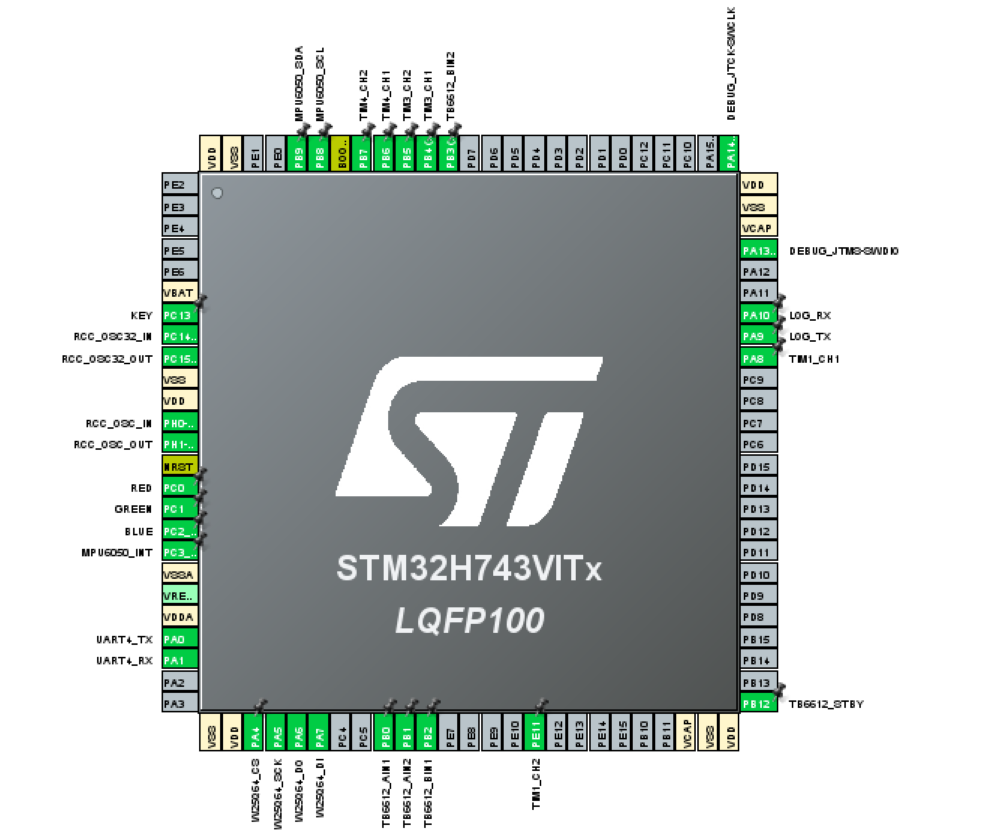

# AI_deploy CubeMX 配置源

> 用途：CubeMX 引脚、时钟、外设、FreeRTOS 配置的**唯一可读配置源**。
> 以后凡涉及引脚改写、新增外设，先改本文件，再回到 CubeMX 同步 `.ioc`，
> 然后所有驱动代码只引用 CubeMX 生成的 `main.h` 宏（`xxx_Pin` / `xxx_GPIO_Port`）与
> HAL 句柄（`hi2c1` / `hspi1` / `huart4` / `husart1` / `htim1`/`htim3`/`htim4`/`htim7`），
> **不硬编码任何引脚号**。

---

## 1. 芯片与主时钟

| 项 | 配置 |
|---|---|
| MCU | STM32H743VITx，LQFP100，Cortex-M7，revV |
| 主频 | CPU = SYSCLK = AXI = 480 MHz |
| Flash latency | VOS0，SCALE0 |
| HSE | 25 MHz 外部晶振，PLL 源 |
| LSE | 32.768 kHz 外部晶振 |
| HCLK | 240 MHz（HPRE = DIV2） |
| APB1 / APB2 | 120 MHz（D2PPRE1/D2PPRE2 = DIV2） |
| 定时器时钟 | TIMxCLK = 240 MHz（APB 预分频 ≠ 1 时自动 ×2） |
| I2C/SPI/UART 时钟 | PCLK1/PCLK2 = 120 MHz |

---

## 2. CubeMX 引脚总览



### 2.1 引脚分配速查表

| 引脚 | User Label | 模式 | 功能 | 备注 |
|---|---|---|---|---|
| PA0 | — | UART4_TX | TJC HMI / 串口屏 | DMA1_Stream0 RX / DMA1_Stream1 TX |
| PA1 | — | UART4_RX | TJC HMI / 串口屏 | 同上 |
| PA4 | `W25Q64_CS` | GPIO_Output | W25Q64 片选 | 高有效，初始化置高 |
| PA5 | `W25Q64_SCK` | SPI1_SCK | W25Q64 时钟 | 40 MHz |
| PA6 | `W25Q64_DO` | SPI1_MISO | W25Q64 数据出 | — |
| PA7 | `W25Q64_DI` | SPI1_MOSI | W25Q64 数据入 | — |
| PA8 | — | TIM1_CH1 | 电机 A PWM | 10 kHz，1000 级 |
| PA9 | `LOG_TX` | USART1_TX | 日志 / VOFA | DMA1_Stream4 RX |
| PA10 | `LOG_RX` | USART1_RX | 日志 / VOFA | 同上 |
| PA13 | — | SWDIO | 调试 | Serial Wire |
| PA14 | — | SWCLK | 调试 | Serial Wire |
| PB0 | `TB6612_AIN1` | GPIO_Output | 电机 A 方向 | Low |
| PB1 | `TB6612_AIN2` | GPIO_Output | 电机 A 方向 | Low |
| PB2 | `TB6612_BIN1` | GPIO_Output | 电机 B 方向 | Low |
| PB3 | `TB6612_BIN2` | GPIO_Output | 电机 B 方向 | Low；SYS 选 Serial Wire 释放 |
| PB4 | — | TIM3_CH1 | 电机 B 编码器 A 相 | Encoder Mode TI12 |
| PB5 | — | TIM3_CH2 | 电机 B 编码器 B 相 | Encoder Mode TI12 |
| PB6 | — | TIM4_CH1 | 电机 A 编码器 A 相 | Encoder Mode TI12 |
| PB7 | — | TIM4_CH2 | 电机 A 编码器 B 相 | Encoder Mode TI12 |
| PB8 | `MPU6050_SCL` | I2C1_SCL | IMU + 磁力计 | 400 kHz；上拉 |
| PB9 | `MPU6050_SDA` | I2C1_SDA | IMU + 磁力计 | 同上 |
| PB12 | `TB6612_STBY` | GPIO_Output | TB6612 使能 | 初始化置高 |
| PC0 | `RED` | GPIO_Output | RGB LED | 高电平灭，上拉 |
| PC1 | `GREEN` | GPIO_Output | RGB LED | 高电平灭，上拉 |
| PC2_C | `BLUE` | GPIO_Output | RGB LED | 高电平灭，上拉 |
| PC3_C | `MPU6050_INT` | EXTI3 | MPU6050 数据就绪中断 | 上拉，上升沿 |
| PC13 | `KEY` | GPIO_Input | 用户按键 | 上拉，低电平触发 |
| PC14 | — | OSC32_IN | LSE | — |
| PC15 | — | OSC32_OUT | LSE | — |
| PE11 | — | TIM1_CH2 | 电机 B PWM | 10 kHz，1000 级 |
| PH0 | — | OSC_IN | HSE | — |
| PH1 | — | OSC_OUT | HSE | — |

> SYS 选 **Serial Wire**，关闭 JTAG，因此 PB3/PB4 释放为普通 GPIO / TIM3 编码器使用。

---

## 3. 外设详细配置

### 3.1 SYS

| 项 | 配置 |
|---|---|
| Debug | Serial Wire（SWDIO/SWCLK） |
| TimeBase Source | TIM6（`TIM6_DAC_IRQn`，优先级 15） |

### 3.2 I2C1（MPU6050 + GY273/QMC5883L）

| 项 | 配置 |
|---|---|
| 引脚 | SCL = PB8，SDA = PB9 |
| 模式 | I2C Master |
| 速度 | Fast Mode Plus，Timing = `0x307075B1`（约 400 kHz） |
| 外部上拉 | 必须，3.3 V |
| 设备地址 | MPU6050 = `0x68`（AD0 接地）；QMC5883L = `0x0D` |

MPU6050 INT 接 PC3，EXTI3 中断触发姿态解算。

### 3.3 SPI1（W25Q64）

| 项 | 配置 |
|---|---|
| 引脚 | CS = PA4，SCK = PA5，MISO = PA6，MOSI = PA7 |
| 模式 | Full-Duplex Master |
| 时钟 | 40 MHz（PCLK2 = 160 MHz，预分频 DIV4） |
| 极性/相位 | CPOL = Low，CPHA = 1 Edge |
| 数据位 | 8 bit |
| DMA | SPI1_TX = DMA1_Stream2，SPI1_RX = DMA1_Stream3 |

### 3.4 USART1（调试 / VOFA）

| 项 | 配置 |
|---|---|
| 引脚 | TX = PA9（`LOG_TX`），RX = PA10（`LOG_RX`） |
| 模式 | Asynchronous |
| 波特率 | 921600（代码中 `DBG_UART_BAUD` 可改） |
| DMA | USART1_RX = DMA1_Stream4（Circular） |
| 中断 | USART1 global interrupt，优先级 8 |

### 3.5 UART4（TJC HMI / 串口屏）

| 项 | 配置 |
|---|---|
| 引脚 | TX = PA0，RX = PA1 |
| 模式 | Asynchronous |
| 波特率 | 115200（TJC 默认；代码中可调） |
| DMA | UART4_RX = DMA1_Stream0（Circular），UART4_TX = DMA1_Stream1（Normal） |
| 中断 | UART4 global interrupt，优先级 6 |

---

## 4. 电机、编码器与控制节拍

### 4.1 TB6612FNG 方向 / 使能 GPIO

| 引脚 | User Label | 方向 | 初始电平 |
|---|---|---|---|
| PB0 | `TB6612_AIN1` | Output Push-Pull | Low |
| PB1 | `TB6612_AIN2` | Output Push-Pull | Low |
| PB2 | `TB6612_BIN1` | Output Push-Pull | Low |
| PB3 | `TB6612_BIN2` | Output Push-Pull | Low |
| PB12 | `TB6612_STBY` | Output Push-Pull | **High** |

TB6612 真值表（STBY = 1）：
- AIN1=1, AIN2=0 → 正转
- AIN1=0, AIN2=1 → 反转
- 同电平 → 刹车 / 停止

### 4.2 PWM 输出（TIM1，TIMxCLK = 240 MHz）

| 通道 | 引脚 | 功能 | 参数 |
|---|---|---|---|
| TIM1_CH1 | PA8 | 电机 A PWM | PSC=24-1，ARR=1000-1，10 kHz，1000 级分辨率 |
| TIM1_CH2 | PE11 | 电机 B PWM | 同上 |

占空比 = `CCR / 1000`（0~1000 对应 0~100%）。

### 4.3 编码器接口（TIM3 / TIM4，4 倍频）

| 电机 | 定时器 | CH1 引脚 | CH2 引脚 | 滤波 |
|---|---|---|---|---|
| 电机 A | TIM4 | PB6 | PB7 | IC1Filter=10 |
| 电机 B | TIM3 | PB4 | PB5 | IC1Filter=IC2Filter=10 |

模式：`Encoder Mode TI1 and TI2`（4 倍频）。
中断未使能，控制任务轮询读 `TIMx->CNT`。

### 4.4 控制环节拍（TIM7）

| 项 | 配置 |
|---|---|
| 时钟 | TIMxCLK = 240 MHz |
| 预分频 | 240-1 → 1 MHz |
| 计数周期 | 1000-1 → 1 kHz |
| 模式 | 内部时钟，ARR preload Enable |
| 中断 | TIM7 global interrupt，优先级 3 |

---

## 5. DMA 配置

| 请求 | 流 | 方向 | 模式 | 数据对齐 | 优先级 |
|---|---|---|---|---|---|
| UART4_RX | DMA1_Stream0 | 外设 → 内存 | Circular | Byte | Low |
| UART4_TX | DMA1_Stream1 | 内存 → 外设 | Normal | Byte | Low |
| SPI1_TX | DMA1_Stream2 | 内存 → 外设 | Normal | Byte | Medium |
| SPI1_RX | DMA1_Stream3 | 外设 → 内存 | Normal | Byte | Medium |
| USART1_RX | DMA1_Stream4 | 外设 → 内存 | Circular | Byte | Low |

DMA 全局中断优先级统一为 6。

---

## 6. NVIC 优先级表

| 中断 | 抢占优先级 | 子优先级 | 说明 |
|---|---|---|---|
| NonMaskableInt / HardFault / MemoryManagement / BusFault / UsageFault / DebugMonitor / SVCall | 0 | 0 | 系统异常，不可调用 FreeRTOS API |
| TIM7_IRQn | 3 | 0 | 电机控制节拍，最高应用优先级 |
| TIM6_DAC_IRQn | 15 | 0 | HAL 时基 |
| SysTick_IRQn | 15 | 0 | FreeRTOS tick |
| PendSV_IRQn | 15 | 0 | 上下文切换 |
| DMA1_Stream0~4_IRQn | 6 | 0 | UART4/SPI1/USART1 DMA |
| SPI1_IRQn | 7 | 0 | SPI 完成中断 |
| UART4_IRQn | 6 | 0 | UART4 IDLE / 错误 |
| USART1_IRQn | 8 | 0 | USART1 IDLE / 错误 |
| EXTI3_IRQn | 6 | 0 | MPU6050 数据就绪 |

FreeRTOS `configLIBRARY_MAX_SYSCALL_INTERRUPT_PRIORITY = 5`：
- 优先级数值 **≤ 5** 的中断（抢占优先级更高）禁止调用 FreeRTOS API；
- TIM7（优先级 3）控制代码中不调用 FreeRTOS API，仅设置标志位。

---

## 7. FreeRTOS 配置

| 项 | 配置 |
|---|---|
| API | CMSIS-RTOS V2 |
| 调度方式 | Preemptive |
| Tick 频率 | 1 kHz |
| 最大优先级 | 56 |
| 堆实现 | Heap_4 |
| 堆大小 | 64 KB（`configTOTAL_HEAP_SIZE = 65536`） |
| FPU | 使能（`configENABLE_FPU = 1`） |
| MPU | 未使能 |
| 静态分配 | 支持 |
| 动态分配 | 支持 |
| 软件定时器 | 使能 |

### 7.1 任务

| 任务名 | 优先级 | 栈深 | 入口函数 | 说明 |
|---|---|---|---|---|
| Task_Inference | 24 | 1024 | `StartInferenceTask` | AI 推理 |
| Task_Motor | 40 | 512 | `StartMotorTask` | 电机控制 |
| Task_Network | 8 | 512 | `StartNetworkTask` | 网络 / 上云 |
| Task_Sensor | 32 | 512 | `StartSensorTask` | 传感器采集 |
| Task_Screen | 8 | 512 | `StartScreenTask` | TJC 屏显 |
| Task_Flash | 9 | 512 | `StartFlashTask` | Flash 持久化 |
| Task_logger | 10 | 512 | `StartLoggerTask` | 日志输出 |

### 7.2 同步对象

| 类型 | 名称 | 初始状态 | 说明 |
|---|---|---|---|
| 互斥量 | `InferenceDataMutex` | Available | AI 输入数据保护 |
| 二值信号量 | `g_semScreenUpdate` | Depleted | 屏幕刷新触发 |
| 二值信号量 | `g_semInferenceLock` | Depleted | 推理完成同步 |
| 二值信号量 | `g_semFlashDmaDone` | Depleted | Flash DMA 完成 |
| 二值信号量 | `g_semAttitudeDataReady` | Available | 姿态数据就绪 |
| 队列 | `g_cmd_q` | 4 项 × 32 byte | 串口命令队列 |

---

## 8. 内存映射

| 区域 | 起始地址 | 大小 | 用途 |
|---|---|---|---|
| ITCMRAM | 0x0000_0000 | 64 KB | 指令 TCM |
| DTCMRAM | 0x2000_0000 | 128 KB | 数据 TCM |
| RAM（D1 AXI SRAM） | 0x2400_0000 | 512 KB | 主 RAM，默认数据区 |
| RAM_D2（D2 AHB SRAM） | 0x3000_0000 | 288 KB | DMA 缓冲区 / 外设数据 |
| RAM_D3（D3 AHB SRAM） | 0x3800_0000 | 64 KB | 备用 |
| FLASH | 0x0800_0000 | 2 MB | 程序 Flash |

---

## 9. 控制环参数（软件层）

> 算法对齐参考例程 `Doc/大鱼电子-电机PID速度位置闭环控制实验例程`（增量式 PI）。
> 编码器 PPR 按 TT 带编码电机常见值 **11**（4 倍频后单圈 44 计数）估算；需按实物铭牌或实测校准 `ENCODER_PPR`。

| 参数 | 符号 | 初值 | 说明 |
|---|---|---|---|
| 控制节拍 | `MOTOR_CTL_DT_MS` | 1 ms | 由 TIM7 提供 |
| 速度环 Kp | `VELOCITY_KP` | 14 | 增量式 PI，待整定 |
| 速度环 Ki | `VELOCITY_KI` | 8 | 增量式 PI，待整定 |
| 位置环 Kp | `POSITION_KP` | 0.04 | 位置→速度目标级联，待整定 |
| PWM 限幅 | `PWM_MAX` | 1000 | = ARR，满占空比 |
| 编码器 PPR | `ENCODER_PPR` | 11 | 单圈计数 = 44（4×），需校准 |
| 最大目标速度 | `TARGET_SPEED_MAX` | 200 计数/节拍 | 由位置环输出限幅 |

---

## 10. 接线速查

```text
        STM32H743            TB6612FNG           电机 A / B
        ------------------------------------------------
        PB0=AIN1  ─────────► AIN1
        PB1=AIN2  ─────────► AIN2
        PA8=TIM1_CH1 ──────► PWMA  ──┐
        PB12=STBY ─────────► STBY    │
        PB2=BIN1  ─────────► BIN1    │
        PB3=BIN2  ─────────► BIN2    │
        PE11=TIM1_CH2 ─────► PWMB  ──┘
        PB6=TIM4_CH1 ──────► 电机 A 编码器 A 相
        PB7=TIM4_CH2 ──────► 电机 A 编码器 B 相
        PB4=TIM3_CH1 ──────► 电机 B 编码器 A 相
        PB5=TIM3_CH2 ──────► 电机 B 编码器 B 相
        (VM 接电机电源 6~12V | VCC 接 3.3V | GND 必须共地)

        STM32H743            MPU6050 / GY273
        ------------------------------------------------
        PB8=I2C1_SCL ──────► SCL
        PB9=I2C1_SDA ──────► SDA
        PC3=MPU6050_INT ───► INT

        STM32H743            W25Q64
        ------------------------------------------------
        PA4=W25Q64_CS  ────► CS
        PA5=W25Q64_SCK ────► CLK
        PA6=W25Q64_DO  ────► DO
        PA7=W25Q64_DI  ────► DI

        STM32H743            TJC 串口屏
        ------------------------------------------------
        PA0=UART4_TX ──────► RX
        PA1=UART4_RX ──────► TX

        STM32H743            USB-TTL（日志 / VOFA）
        ------------------------------------------------
        PA9=USART1_TX ─────► RX
        PA10=USART1_RX ────► TX
```

> **VCC 电平铁律**：TB6612 逻辑供电 `VCC` 必须接 **3.3 V**（取自 STM32 板），不能接 5 V。
> FNG 输入高门槛 `Vih = 0.7 × VCC`，VCC=5 V 时 Vih=3.5 V，H7 GPIO 高电平约 3.3 V，会识别失败。
> VCC=3.3 V 时 Vih=2.31 V，余量充足。电机动力电 `VM` 与逻辑电 `VCC` 独立。
> **STM32 / TB6612 / 电机电源三地必须物理共地**。

---

## 11. 修改流程

1. 在 CubeMX 中调整引脚 / 外设 / FreeRTOS / 时钟。
2. 重新生成代码。
3. 更新本文件对应章节，使其与 `.ioc` 一致。
4. 驱动代码只使用 `main.h` 中的 `xxx_Pin` / `xxx_GPIO_Port` 宏和 HAL 句柄；禁止写死 GPIO 端口号。
5. Keil 中 Rebuild，确认 0 错误。
