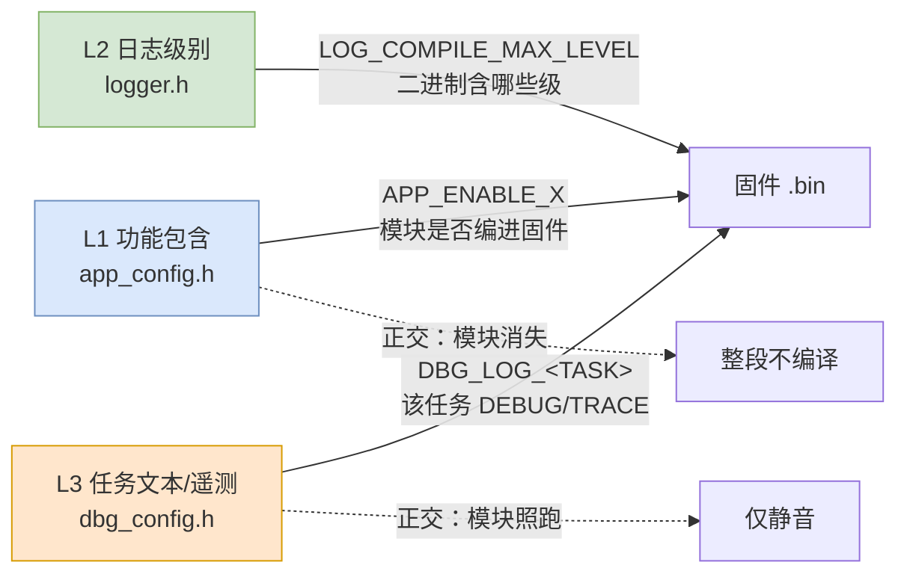
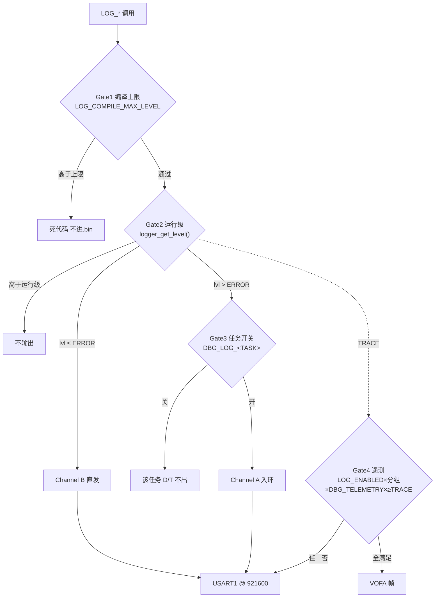

# 调试手册 — DEBUG / LOGGER / APP 宏配置速查

> 用途：改配置前先查本表，确认"改哪个宏、默认是什么、关掉/打开什么效果"。
> 深读（原理/取证）见 `Components/Debug/Ref/log_gating.md`（L2+L3 门控）、`Components/Debug/Ref/module_gating.md`（L1 功能门控+命令台）。Logger 模块架构见 §10。本手册只给"查/改/效"。
> 真相源：`logger.h`(L2) / `dbg_config.h`(L3) / `app_config.h`(L1)。文档须与之对齐。

---

## 0. 一图看懂：三层正交门控



> 三轴**正交、不冗余**：L1 决定"模块在不在"（关→整段消失）；L3 决定"在跑的模块出不出文本"（关→照跑但静音）；L2 决定"二进制里有哪些级别"。

---

## 1. 宏配置总表（真相源）

### 1.1 L1 功能包含 — `Components/Debug/Inc/app_config.h`

| 派生宏（勿手改） | 任务 | 模块 | 当前 `APP_PROFILE_LOGGER` 下 |
|---|---|---|---|
| `APP_ENABLE_LOGGER` | `StartLoggerTask` | 日志/VOFA/控制台（**常驻核心**） | **1** |
| `APP_ENABLE_INFERENCE` | `StartInferenceTask` | 故障诊断 INT8 推理 | 0（未定义） |
| `APP_ENABLE_MOTOR` | `StartMotorTask` | TB6612FNG 双电机 | 0 |
| `APP_ENABLE_NETWORK` | `StartNetworkTask` | ESP-01S WiFi/MQTT | 0 |
| `APP_ENABLE_SENSOR` | `StartSensorTask` | MPU6050 姿态/滤波 | 0 |
| `APP_ENABLE_SCREEN` | `StartScreenTask` | 淘晶驰串口屏 | 0 |
| `APP_ENABLE_FLASH` | `StartFlashTask` | W25Q64 黑匣子/自检 | 0 |
| `APP_ENABLE_ESP32S3` | `StartEsp32S3Task` | ESP32-S3 图像协处理 | 0 |
| `APP_ENABLE_WATCHDOG` | — | IWDG+TIM7 心跳（**调试态=0**） | **0** |

> 用户接口 = 顶部 `#define` 一个 `APP_PROFILE_*`；未选任何 profile → 默认**全功能**（8 个 `APP_ENABLE_X` 全 1）。依赖方向：`ESP32S3→Inference`、`Sensor→Inference/Motor/Screen`、`Inference→Network`、`Logger` 被所有依赖。

| Profile（定义即生效） | 自动开启 |
|---|---|
| `APP_PROFILE_LOGGER` | Logger |
| `APP_PROFILE_SENSOR` | Sensor, Logger |
| `APP_PROFILE_MOTOR` | Motor, Sensor, Logger |
| `APP_PROFILE_ESP32S3` | Esp32S3, Logger |
| `APP_PROFILE_INFERENCE` | Inference, Esp32s3, Sensor, Logger |
| `APP_PROFILE_NETWORK` | Network, Inference, Esp32s3, Sensor, Logger |
| `APP_PROFILE_SCREEN` | Screen, Sensor, Logger |
| `APP_PROFILE_FLASH` | Flash, Logger |

### 1.2 L2 全局日志级别 — `Components/Logger/Inc/logger.h`

| 宏 | 默认 | 含义 / 约束 |
|---|---|---|
| `LOG_ENABLED` | **定义** | 总闸；注释→所有 `LOG_*` 变 `((void)0)`，零开销 |
| `LOG_COMPILE_MAX_LEVEL` | `LOG_LVL_INFO`(3) | 编进二进制最高级（**硬上限**）；单文件可 `#define LOG_LOCAL_LEVEL` 覆盖 |
| `LOG_RUNTIME_DEFAULT_LEVEL` | `LOG_LVL_INFO`(3) | 运行默认级；**必须 ≤ 编译上限**（`#error` 兜底非法） |
| `LOG_SHOW_FILE_LINE` | `1` | 打印 `文件:行号` |
| `LOG_LVL_FATAL..TRACE` | `0..5` | 级别常量（见 §2） |

### 1.3 L3 每任务文本 + 遥测 — `Components/Debug/Inc/dbg_config.h`

> ⚠️ **门控陷阱**：`DBG_LOG_ENABLE`/`DBG_LOG_<TASK>`/`DBG_UART_BAUD` 仅在 `LOG_RUNTIME_DEFAULT_LEVEL ≥ DEBUG` 才编入（默认 INFO → 整段跳过 → **实际 0**）；`DBG_TELEMETRY_*` 仅在 `≥ TRACE` 才编入（默认 **0**）。想开必须先提编译上限+运行级。

| 宏 | 定义值 | 实际生效条件 | 作用 |
|---|---|---|---|
| `DBG_LOG_ENABLE` | 1 | 运行级≥DEBUG 才编入（默认 INFO→0） | 任务级 DEBUG/TRACE 文本总闸 |
| `DBG_LOG_DIAG` | 0 | 同上 | 离线推理测试文本 |
| `DBG_LOG_MOTOR` | 0 | 同上 | 电机环文本 |
| `DBG_LOG_NET` | 0 | 同上 | 网络摘要文本 |
| `DBG_LOG_SENSOR` | 0 | 同上 | 姿态/滤波文本 |
| `DBG_LOG_SCREEN` | 0 | 同上 | 屏显文本 |
| `DBG_LOG_FLASH` | 0 | 同上 | Flash 文本 |
| `DBG_LOG_LOGGER` | 0 | 同上 | 日志任务自身文本 |
| `DBG_LOG_ESP32S3` | 0 | 同上 | 图像结论帧文本 |
| `DBG_LOG_POSTEST` | 1 | 同上 | Selftest 探针（定位卡死/复位环） |
| `DBG_TELEMETRY_ENABLE` | 1 | 运行级≥TRACE 才编入（默认 0） | 遥测总开关 |
| `DBG_TELEMETRY_IMU` | 1 | 同上 | 遥测组A（MPU6050/姿态） |
| `DBG_TELEMETRY_MOTOR` | 1 | 同上 | 遥测组B（电机速度环） |
| `DBG_TELEMETRY_SYSTEM` | 0 | 同上 | 遥测组C（系统，默认关） |
| `DBG_UART_BAUD` | 921600 | ≥DEBUG | VOFA 口波特率（VOFA 须同步） |
| `DBG_FRAME_N` | 44 | ≥TRACE | 固定帧宽（**勿改**，须与 `dbg_telemetry.c`/README 一致） |
| `DEBUG_ISR_CNT_*` | 0 | — | 临时 ISR 计数器（调中断链路用，配 Keil Watch） |

---

## 2. 六级级别语义

| 级别 | 值 | 含义 | 工业 |
|---|---|---|---|
| `FATAL` | 0 | 不可恢复、通常重启 | 必备 |
| `ERROR` | 1 | 意外但已恢复、能继续 | 必备 |
| `WARN` | 2 | 意料外但不算错误，隐患 | 必备 |
| `INFO` | 3 | 重要周期/用户事件（**线上默认最低**） | 必备 |
| `DEBUG` | 4 | 调试变量/路径 | 常见 |
| `TRACE` | 5 | 每迭代/每样本（VOFA 波形） | 可选 |

> `FATAL(0)` 永远编译进、不受运行级过滤；其余受 `LOG_COMPILE_MAX_LEVEL`+运行级双重裁剪。

---

## 3. 门控级联（有效级 = min）



> **铁律**：`LOG_COMPILE_MAX_LEVEL ≥ LOG_RUNTIME_DEFAULT_LEVEL`；`Gate3` 仅裁 DEBUG/TRACE（INFO 及以下不受其管）；`Gate4` 是遥测额外最严 AND。

---

## 4. 通道分流

| 级别 | 通道 | 落地 | 依赖抽空任务 |
|---|---|---|---|
| `FATAL`/`ERROR` + 系统里程碑(`LOG_EMIT_DIRECT`) | **B 保证** | `logger_emit_direct`→PRIMASK+TXE 整行同步直发 + 副本进 `s_crit_rb` 黑匣子 | **否**（必落线） |
| `WARN`/`INFO`/`DEBUG`/`TRACE` | **A 异步** | `logger_emit`→主环 `s_rb`→`StartLoggerTask` 抽空 | 是（best-effort） |

---

## 5. 运行期调级（免重烧）

| 手段 | 操作 | 前提 | 效果 |
|---|---|---|---|
| 串口命令 | `debug<n>`（n=0..5 对应 FATAL..TRACE） | `LOG_ENABLED` 定义 | 现场调级；生效=min(编译上限,n)；回显 `> log level -> n` |
| 调试器 | Keil Watch 改 `s_log_runtime_level` / Command `s_log_runtime_level=5` | 同上 + ST-Link | 最快，仅开发机 |
| 永久放开某任务 | 烧录前 `DBG_LOG_<TASK>=1` + `LOG_COMPILE_MAX_LEVEL` 保持 `DEBUG` | — | 该任务 DEBUG 常编进 |

> 控制台常驻（由 `StartLoggerTask` 消费 `g_cmd_qHandle`），关任意 `APP_ENABLE_X` 后 `debug<n>` 仍有效。

---

## 6. Profile → 模块映射（单模块调试用）

| 想只调 | 选 Profile | 实际编进 |
|---|---|---|
| 日志底座 | `APP_PROFILE_LOGGER` | Logger |
| 姿态 | `APP_PROFILE_SENSOR` | Sensor, Logger |
| 电机 | `APP_PROFILE_MOTOR` | Motor, Sensor, Logger |
| 图像 | `APP_PROFILE_ESP32S3` | Esp32s3, Logger |
| 推理 | `APP_PROFILE_INFERENCE` | Inference, Esp32s3, Sensor, Logger |

---

## 7. 单模块调试操作步骤

1. `app_config.h` 顶部 `#define APP_PROFILE_<X>`（其余注释掉）
2. （可选）`dbg_config.h` 开 `DBG_LOG_ENABLE=1` + `DBG_LOG_<X>=1`
3. **Keil Rebuild → Download**（动了 `app_config.h`/`freertos.c`）
4. VOFA 波特率设 **921600**（对齐 `DBG_UART_BAUD`）
5. 串口发 `debug5`(TRACE) 看波形 / `debug3`(INFO) 静音；控制台始终可用
6. 验证：仅目标+依赖任务在跑（其余任务空函数体立即 `osThreadTerminate(osThreadGetId())` 自删）

---

## 8. 常见组合速查

| 想要 | 改哪里 | 效果 |
|---|---|---|
| 发布静音 | `LOG_ENABLED` 注释 + `DBG_LOG_ENABLE=0` | 零日志/零遥测 |
| 开某任务 DEBUG | `LOG_COMPILE_MAX_LEVEL≥DEBUG` + `DBG_LOG_<TASK>=1` + 串口 `debug4` | 该任务 DEBUG 出 |
| 看 VOFA 波形 | `DBG_TELEMETRY_ENABLE=1` + `LOG_COMPILE_MAX_LEVEL≥TRACE` + 串口 `debug5` | 遥测帧发 |
| 只调电机 | `APP_PROFILE_MOTOR` | 仅 Motor+Sensor+Logger |
| 现场抓故障不重烧 | 串口 `debug<n>` | 实时收窄/放宽到编译上限 |

---

## 9. 铁律速记

1. 观测宏/计数器统一在 `dbg_config.h`，禁 `.c` 散写 `#define DBG_*`。
2. 发布态：`DBG_TELEMETRY_ENABLE=0` + `DBG_LOG_ENABLE=0`（子开关随全 0）→ 零调试开销。
3. `LOG_COMPILE_MAX_LEVEL ≥ LOG_RUNTIME_DEFAULT_LEVEL`（`#error` 兜底）。
4. 遥测 = `LOG_ENABLED` × 任一分组(IMU/MOTOR/SYSTEM) × `DBG_TELEMETRY_ENABLE` × 运行≥TRACE（四层严格 AND）。
5. 任务自删用 `osThreadTerminate(osThreadGetId())`；**禁 `osThreadTerminate(NULL)`**（CMSIS 下 NULL=参数错 NO-OP → 落 `prvTaskExitError`）。
6. 新增调试需求 → 先在 `dbg_config.h` 加宏，再在业务代码 `#if` 引用，不动文件结构。
7. 一次性硬件自检用 `#ifdef LOG_ENABLED` 包裹（生产变空），优先 logger 宏而非裸 `printf`。
8. 改 `app_config.h`/`dbg_config.h`/`logger.h` 任一项 → 必 Keil Rebuild（否则不生效）。
9. 出 bug 先查 `Components/Debug/error.md`（运行期，按任务 E 事件）+ 编译/链接查 `compile_link_error.md` + uvprojx 查 `uvprojx_error.md`。

---

## 10. Logger 模块架构与用法（合并自 Doc/logger.md）

### 10.1 定位与文件
- 统一日志，替代裸 `printf/fputc` 轮询。
- 文件：`Components/Logger/Inc/logger.h` / `Src/logger.c`（放 `Components/` 非 `Core/`，避 CubeMX 重生覆盖）。

### 10.2 设计要点
| 特性 | 说明 |
|---|---|
| 分级 | FATAL(0)…TRACE(5)；FATAL 永远编译进，不受运行级过滤 |
| 格式 | `[ms][级别][标签] (file:line) 内容\r\n` |
| 时间戳 | `DWT->CYCCNT`（ISR 安全，ms；非 `HAL_GetTick()`，避免 SysTick 优先级问题） |
| 标签 | 模块/任务名：`INFER`/`MOTOR`/`NET`/`FLASH`… |
| 两级过滤 | `LOG_COMPILE_MAX_LEVEL`(硬上限) + `LOG_RUNTIME_DEFAULT_LEVEL`(运行默认) |
| 异步 Channel A | WARN/INFO/DEBUG/TRACE → `s_rb` 环 → `StartLoggerTask` 抽空刷 USART1 |
| 保证 Channel B | FATAL/ERROR/里程碑 → `logger_emit_direct` PRIMASK 整行直发 + 副本进 `s_crit_rb` 黑匣子 |
| 线程/中断安全 | 入环用 `PRIMASK` 关中断，不依赖 RTOS |
| 可插拔后端 | `log_backend_putc` 为 `__weak`，`BSP_LOG.c` 提供 USART1 真实输出 |
| 黑匣子 | `logger_flush_to_flash()` 刷 W25Q64 末扇区，HardFault 可调用 |

### 10.3 用法
```c
#include "logger.h"
LOG_I("DIAG", "Task Started. samples=%d", n);
LOG_E("FLASH", "ID mismatch: 0x%06X", id);
LOG_D("MOTOR", "pwm=%d angle=%.2f", pwm, angle);
```
单文件覆盖（仅该文件生效，例：某驱动只开到 WARN）：
```c
#define LOG_LOCAL_LEVEL LOG_LVL_WARN
#include "logger.h"
```

### 10.4 黑匣子（Flash 崩溃日志）
- 调用：`logger_flush_to_flash()`（已在 `HardFault_Handler` 调用）。
- 写路径：环形缓冲线性化 → `w25q_crashlog_save()` 轮询写 W25Q64；**不依赖 RTOS/DMA**，HardFault 中可用。
- 布局：末扇区 `0x7FF000`，前 8B = magic `CRSH` + 日志长度，之后日志体。

### 10.5 注意事项
| 项 | 值 |
|---|---|
| `LOG_LINE_MAX` | 160（超长截断） |
| `LOG_RB_SIZE` | 1024（满覆盖最旧） |
| `StartLoggerTask` 优先级 | 低（勿阻塞实时任务） |

### 10.6 与 BSP/HAL 关系
- 日志实现**不塞进** BSP/HAL 驱动；驱动只调 `LOG_*` 宏，后端弱符号接入 → 日志与串口/Flash 解耦，便于复用测试。
